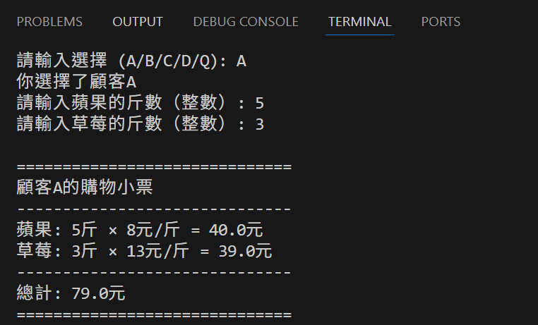

# 水果價格試算系統設計報告

# 一、項目概述

本項目是一個水果價格試算系統，針對銷售蘋果、草莓和芒果三種水果，根據不同顧客的購買方案計算總價。系統支持四種顧客方案，並提供了命令行界面和圖形化界面兩種使用方式。

# 二、方案需求分析

| **顧客** | **購買商品** | **促銷活動** | **蘋果價格** | **草莓價格** | **芒果價格** |
| --- | --- | --- | --- | --- | --- |
| A | 蘋果、草莓 | 無 | 8元/斤 | 13元/斤 | - |
| B | 蘋果、草莓、芒果 | 無 | 8元/斤 | 13元/斤 | 20元/斤 |
| C | 蘋果、草莓、芒果 | 草莓8折 | 8元/斤 | 13元/斤（8折） | 20元/斤 |
| D | 蘋果、草莓、芒果 | 草莓8折 + 滿100減10 | 8元/斤 | 13元/斤（8折） | 20元/斤 |

# 三、系統設計

## 3.1 技術棧

- 編程語言: Python 3.13.5.final.0
- GUI框架: Tkinter
- VScode Version: 1.107.1
- 系统：Windows 11 家庭中文版，64位

## 3.2 類結構設計

系統採用面向對象設計，主要包含以下類：

### 3.2.1 Fruit類

```python
class Fruit:
    def __init__(self, name, price):
        self.name = name
        self.price = price
    
    def calculate_price(self, weight, discount=1.0):
        return self.price * weight * discount
```

- **`__init__()` 方法**：用於初始化水果實例，設置水果名稱和單價。參數為水果名稱和價格（元/斤）。
- **`calculate_price()` 方法**：用於計算該水果的總價。參數為水果斤數和折扣率（默認為1.0）。

### 3.2.2 ShoppingSystem類

```python
class ShoppingSystem:
    def __init__(self):
        self.fruits = {
            'apple': Fruit('蘋果', 8),
            'strawberry': Fruit('草莓', 13),
            'mango': Fruit('芒果', 20)
        }

    def calculate_price(self, apple_weight=0, strawberry_weight=0, mango_weight=0, strawberry_discount=1.0, discount_threshold=0, discount_amount=0):
        return total
    
    def calculate_customer_a(self, apple_weight, strawberry_weight):
        return self.calculate_price(apple_weight, strawberry_weight)
    
    def calculate_customer_b(self, apple_weight, strawberry_weight, mango_weight):
        return self.calculate_price(apple_weight, strawberry_weight, mango_weight)
    
    def calculate_customer_c(self, apple_weight, strawberry_weight, mango_weight):
        return self.calculate_price(apple_weight, strawberry_weight, mango_weight, strawberry_discount=0.8)
    
    def calculate_customer_d(self, apple_weight, strawberry_weight, mango_weight):
        return self.calculate_price(apple_weight, strawberry_weight, mango_weight, 
               strawberry_discount=0.8, discount_threshold=100, discount_amount=10)
    
    def print_receipt(self, apple_weight, strawberry_weight, mango_weight, 
                      strawberry_discount=1.0, discount_threshold=0, discount_amount=0, customer_name=""):
        return total
```

ShoppingSystem類主要用於管理整個水果銷售系統，包含四種顧客方案的計算邏輯和收據打印功能。

- **`__init__()` 方法**：用於初始化購物系統，創建三種水果實例並存儲在字典中。
- **`calculate_price()` 函數**：用於通用價格計算，處理所有顧客方案的統一計算邏輯。參數為蘋果斤數、草莓斤數、芒果斤數、草莓折扣、滿減門檻和滿減金額。
- **`calculate_customer_a()` 函數**：用於計算顧客A的總價，只買蘋果和草莓，無促銷。參數為蘋果斤數和草莓斤數。
- **`calculate_customer_b()` 函數**：用於計算顧客B的總價，買三種水果，無促銷。參數為蘋果斤數、草莓斤數和芒果斤數。
- **`calculate_customer_c()` 函數**：用於計算顧客C的總價，買三種水果，草莓8折。參數為蘋果斤數、草莓斤數和芒果斤數。
- **`calculate_customer_d()` 函數**：用於計算顧客D的總價，買三種水果，草莓8折，滿100減10。參數為蘋果斤數、草莓斤數和芒果斤數。
- **`print_receipt()` 函數**：用於打印購物小票，顯示詳細的購買信息和計算結果。參數為各種水果斤數、折扣信息、滿減信息和顧客名稱。

## 3.3 輔助函數

- **`get_user_input()` 函數**：用於獲取用戶輸入的水果斤數，提供輸入驗證功能。參數為水果名稱和是否允許為零的標誌。
- **`interactive_mode()` 函數**：用於實現交互式命令行界面，讓用戶選擇顧客類型並輸入購買信息。無參數。

## 3.4 算法設計

### 3.4.1 價格計算算法

```python
總價 = 蘋果價格 + 草莓價格 + 芒果價格
蘋果價格 = 蘋果單價 × 蘋果斤數
草莓價格 = 草莓單價 × 草莓斤數 × 草莓折扣
芒果價格 = 芒果單價 × 芒果斤數
if(總價 ≥ 滿減門檻):
    最終價格 = 總價 - 滿減金額
else:
    最終價格 = 總價
```

# 四、測試驗證

## 4.1 測試用例

### 4.1.1 顧客A測試用例

基於顧客A方案的測試結果，系統在所有測試場景下均表現出正確的計算能力。在正常購買情況下（5斤蘋果、3斤草莓），系統準確計算出總價79元。



在邊界條件測試中，當只購買單一水果時（10斤蘋果或5斤草莓），系統分別正確計算出80元和65元。


即使在大量購買情境下（20斤蘋果、15斤草莓），系統仍能正確處理並計算出355元的總價。所有測試用例均通過驗證，表明系統的計算邏輯準確無誤。


### 4.1.2 顧客B測試用例

基於顧客B方案的測試結果，系統在多種購買組合下均能準確計算總價。在正常購買情境（5斤蘋果、3斤草莓、2斤芒果）中，系統正確計算出119元的總價。


### 4.1.3 顧客C測試用例

在顧客C方案的多樣化測試中，系統展現了完整的折扣計算能力。正常購買情境（5斤蘋果、3斤草莓、2斤芒果）的測試結果111.2元證明了混合購買時折扣邏輯的正確性。


只購買草莓購買測試（10斤草莓），系統準確計算出104元的總價，這顯示系統不僅能處理混合購買，也能正確應對單一品種大量購買的折扣計算，完全符合草莓8折的優惠規則。


### 4.1.4 顧客D測試用例

在顧客D方案的綜合測試中，系統成功驗證了複雜促銷規則的正確執行。當購買金額達到滿減門檻時（5斤蘋果、3斤草莓、2斤芒果），系統正確應用草莓8折和滿100減10雙重優惠，計算出最終價格101.2元。


在未達滿減門檻的測試中（各1斤），系統準確識別只應用草莓8折優惠，計算出38.4元的正確結果。這兩項測試完整證明了系統能夠智能判斷優惠條件，精確執行多重促銷規則。


## 4.2 邊界條件測試

全為零輸入: 系統應提示警告


負數輸入: 系統應拒絕並提示錯誤


超大數字: 系統應正常處理


方案A買芒果: 系統應提示方案限制


## 4.3 界面測試

方案切換: 方案A隱藏芒果輸入框


全屏切換: F11和ESC功能正常


輸入驗證: 非數字輸入被拒絕


[https://github.com/ken11200211/ICBC_FruitPriceCalculator](https://github.com/ken11200211/ICBC_FruitPriceCalculator)